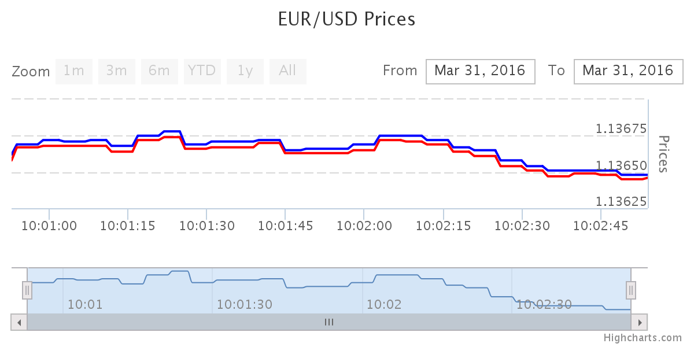
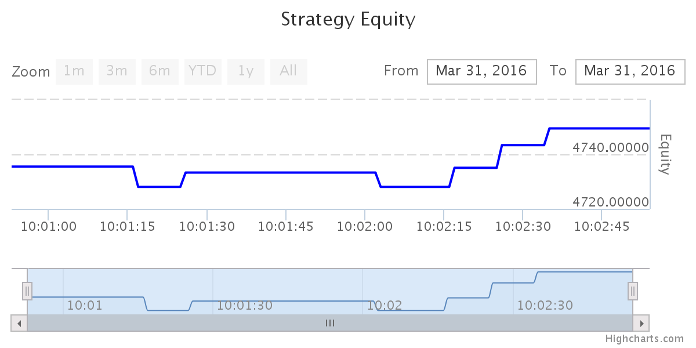

# REST API Javascript Examples
This repository contains an html file that use a Javascript wrapper that sets up a price streaming session, order streaming session, position streaming session and indicator streaming session:

At load the page also use the wrapper to make a call to polling service of prices, order and position. These services can be called again clicking in their "Reload" button.

Also you can trade using "BUY" and "SELL" button and cancel or modify pending orders.

Using price streaming service and HighCharts the html file displays the following graph:



Using position streaming service and HighCharts the html file displays equity graph:



Using indicator streaming service and HighCharts the html file displays candlestick and Bollinger bands:


If you want to modify or develop a new HTML page using this wrapper you must instantiate the wrapper object:
```
var wrapper = Object.create(Wrapper);
//wrapper.url = "./";
wrapper.url = "http://actfx.adhara.io:81";
wrapper.user = "demo";
wrapper.password = "demo";
```

then authenticate and finally use the REST-API services.
The wrapper use promises for asynchronous programming, so you have to use the following method

```
wrapper.getAuthentication()
.then(function(resp){
	getPriceStreaming();
});
```

the "getPriceStreaming" function must have this format:
```
function getPriceStreaming(){
	wrapper.getPriceStreaming( securitylist, tinterfacelist, granularity, level, interval, function processPrices(entry) {
			if (entry.hasOwnProperty('getPriceResponse')) {
				if (entry.getPriceResponse.hasOwnProperty('tick')) {
					entry.getPriceResponse.tick.forEach(function(tick) {
						// Your code for each price tick
					});
				}
			}
		}
	);
}
```

the parameters are described in API-REST documentation but last one is callback function where wrapper return the API-REST result.


## Prerequisites
You will need a webserver you can upload to the html code (including css file), the javascript wrapper and the libraries that it uses. The example will not work if you simply 'read' or 'open file' the locally stored html file. Probably you have to fix "CORS" problems.


